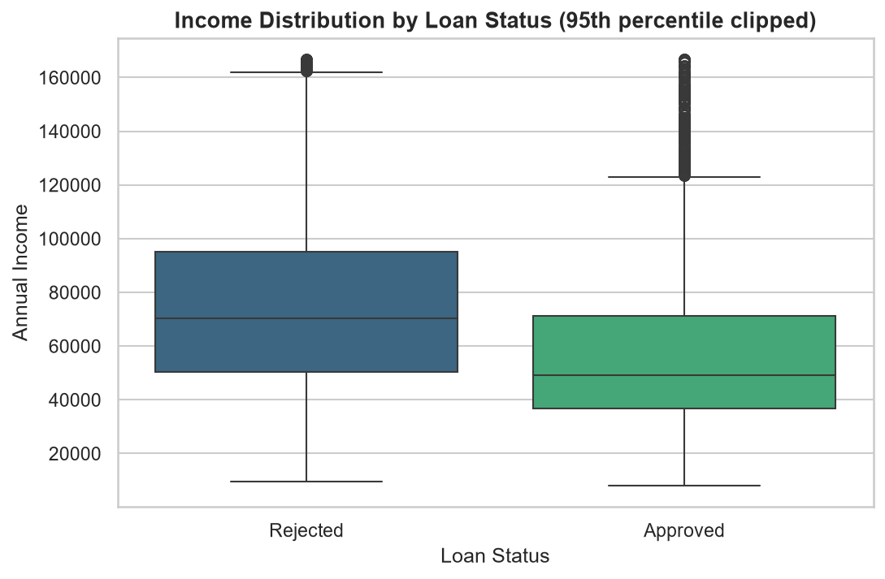

# 🏦 Bank Loan Analysis & Credit Risk Assessment Dashboard

An end-to-end data analytics project that analyzes 45,000 bank loan applications to uncover the key drivers behind loan approval decisions and credit risk — built using Python for data cleaning and exploratory analysis, and Tableau for interactive business intelligence dashboards.

---

## 📌 Project Overview

Banks receive thousands of loan applications and must decide, consistently and fairly, who gets approved. This project simulates that analytical process end-to-end:

- Cleans and validates a raw loan application dataset
- Explores approval/rejection patterns across income, gender, loan purpose, credit score, credit history, and home ownership
- Identifies the **strongest statistical predictors** of loan approval using correlation analysis
- Visualizes every finding with Python (Matplotlib/Seaborn) and an interactive Tableau dashboard
- Documents clear, data-backed business insights at every step

**Core question answered:** *What actually drives a bank's loan approval decision — and is the process fair across demographic groups?*

---

## 🎯 Key Business Insight

The strongest predictor of loan approval in this dataset is **not** income or credit score — it's the **loan-to-income ratio** (`loan_percent_income`, correlation = 0.38) and **interest rate tier** (`loan_int_rate`, correlation = 0.33). Raw credit score and credit history length showed almost no correlation with approval outcome (≤ 0.01), which is a genuinely counter-intuitive, presentable finding. A prior default on file is the single strongest deterministic rule: it results in 100% rejection.

Gender showed no meaningful difference in approval rates (22.25% female vs. 22.20% male) — a positive fairness signal worth calling out explicitly.

---

## 🗂️ Dataset

- **Source:** [Bank Loan Data (Kaggle)](https://www.kaggle.com/datasets/udaymalviya/bank-loan-data)
- **Size:** 45,000 rows × 14 original columns
- **Target column:** `loan_status` — `1` = Approved, `0` = Rejected

> **Note on terminology:** This dataset does not include a literal "occupation" column. `loan_intent` (the stated purpose of the loan — e.g., education, medical, venture, debt consolidation) is used as the closest available proxy for occupation/purpose-based segmentation throughout this analysis, and is labeled as such wherever used.

> **Data quality note:** `person_age` contains a small number of clearly erroneous values (max = 144), which the cleaning pipeline flags via IQR-based outlier detection rather than silently deleting — preserving the row for transparency while marking it for exclusion in age-sensitive analysis if needed.

---

## 🛠️ Tech Stack

| Tool | Purpose |
|---|---|
| **Python 3.14** | Core scripting language |
| **pandas** | Data loading, cleaning, transformation |
| **numpy** | Numerical operations |
| **matplotlib / seaborn** | Static statistical visualizations |
| **scipy** | Statistical calculations |
| **Tableau Desktop** | Interactive BI dashboard |
| **VS Code** | Development environment |
| **Git & GitHub** | Version control and portfolio hosting |

---

## 📁 Project Structure

```
bank-loan-analysis/
│
├── data/
│   ├── raw/                          # Original, untouched dataset
│   │   └── loan_data.csv
│   └── processed/                    # Cleaned, analysis-ready dataset
│       └── loan_data_cleaned.csv
│
├── src/                              # Modular Python source code
│   ├── data_loader.py                # Load + inspect raw data
│   ├── data_cleaner.py               # Missing values, duplicates, dtypes, outliers
│   ├── eda_analysis.py               # All exploratory data analysis functions
│   ├── visualization.py              # Matplotlib/Seaborn chart generation
│   └── utils.py
│
├── outputs/
│   ├── charts/                       # 11 saved PNG charts + dashboard screenshot
│   └── reports/                      # Text/CSV summary outputs
│
├── tableau/
│   └── bank_loan_analysis_dashboard.twbx
│
├── main.py                           # Runs the full pipeline end-to-end
├── requirements.txt
├── .gitignore
└── README.md
```

---

## 🚀 How to Run This Project

```powershell
# 1. Clone the repository
git clone https://github.com/azmiyaazmii25/bank-loan-analysis-credit-risk-dashboard.git
cd bank-loan-analysis-credit-risk-dashboard

# 2. Create and activate a virtual environment
python -m venv venv
venv\Scripts\activate

# 3. Install dependencies
pip install -r requirements.txt

# 4. Run the entire pipeline (load → clean → analyze → visualize)
python main.py
```

Running `main.py` will:
1. Load the raw dataset and print an inspection summary
2. Clean the data (missing values, duplicates, data types, outlier flags)
3. Save the cleaned dataset to `data/processed/`
4. Run all 11 exploratory analyses and print results
5. Generate and save all 11 charts to `outputs/charts/`

The Tableau dashboard can be opened directly via `tableau/bank_loan_analysis_dashboard.twbx` in Tableau Desktop or Tableau Reader.

---

## 📊 Exploratory Data Analysis — Key Findings

| Analysis | Finding |
|---|---|
| **Approval Rate** | Only 22.22% of applications are approved overall |
| **Income** | Approved applicants have *lower* average income (₹59,886) than rejected ones (₹86,157) — loan-to-income ratio matters more than raw income |
| **Gender** | No meaningful difference: 22.25% (female) vs 22.20% (male) approval rate |
| **Loan Intent** | Debt consolidation (30.27%) and medical (27.82%) approve most often; venture (14.43%) and education (16.96%) approve least |
| **Credit Score** | Nearly identical between approved (631.9) and rejected (632.8) groups — not a strong standalone predictor |
| **Credit History Length** | Also nearly identical (5.76 vs 5.90 years) — weak standalone predictor |
| **Loan Amount** | Approved loans are *larger* on average (₹10,855 vs ₹9,219) |
| **Previous Defaults** | Applicants with a prior default on file are rejected 100% of the time — the strongest deterministic rule in the dataset |
| **Home Ownership Risk** | Homeowners (OWN: 92.5%, MORTGAGE: 88.4%) are rejected more often than renters (67.6%) |
| **Correlation Analysis** | `loan_percent_income` (0.38) and `loan_int_rate` (0.33) are the strongest predictors of approval; income, credit score, and credit history are all weak (≤ 0.19) |

---

## 📈 Visualizations

All charts below are generated by `src/visualization.py` and saved to `outputs/charts/`.

| Chart | Description |
|---|---|
| `01_approval_distribution.png` | Approved vs rejected application counts |
| `02_income_by_status.png` | Income distribution by loan outcome |
| `03_gender_approval.png` | Approval rate by gender |
| `04_loan_intent_approval.png` | Approval rate by loan purpose |
| `05_credit_score_distribution.png` | Credit score distribution by outcome |
| `06_credit_history_length.png` | Credit history length by outcome |
| `07_loan_amount_distribution.png` | Loan amount by outcome |
| `08_previous_default_impact.png` | Rejection rate by prior default history |
| `09_risk_by_home_ownership.png` | Rejection rate by home ownership |
| `10_correlation_heatmap.png` | Full correlation matrix of numeric risk factors |
| `11_loan_percent_income_impact.png` | Loan-to-income ratio — the strongest predictor |

---

## 📊 Interactive Tableau Dashboard

The Tableau dashboard (`tableau/bank_loan_analysis_dashboard.twbx`) brings the analysis to life with:

- **4 KPI cards:** Total Applications, Approval Rate, Avg Credit Score, Avg Loan Amount
- **4 interactive charts:** Approval Rate by Loan Intent, Income Distribution by Loan Status, Approval Rate by Gender, Rejection Rate by Home Ownership
- **3 interactive filters:** Loan Intent, Gender, Home Ownership — applied dashboard-wide, so any selection updates every chart and KPI simultaneously



---

## 🔮 Future Enhancements

- Build a machine learning classification model (logistic regression / random forest) to predict approval probability and compare against the correlation-based findings here
- Deploy an interactive version of the analysis using Streamlit for a live, browser-based demo
- Automate the pipeline with a scheduler (e.g., Airflow or a simple cron job) to simulate a production data pipeline
- Add statistical significance testing (chi-square, t-tests) to confirm which group differences are statistically meaningful vs. noise
- Publish the Tableau dashboard to Tableau Public for a shareable live link

---

## 👤 Author

**Azmiya**
📧 azmiyaazmii25@gmail.com
🔗 [LinkedIn](https://www.linkedin.com/in/azmiya-59a266373)
🔗 [GitHub Repository](https://github.com/azmiyaazmii25/bank-loan-analysis-credit-risk-dashboard)
